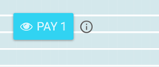

# HTML Tags

Digital goods can be included on a web page by defining special *HTML tags*, which will then be controlled by the SatoshiPay [widget](#sun-of-satoshi). Content types for [text](#text), [images](#image), [audio files](#audio), [videos](#video) and [downloads](#download) are supported. Find a complete list of [supported types](#supported-content-types) in the reference section.

Before purchase, a digital good is represented on the merchant's website by a placeholder. These placeholders are injected by the SatoshiPay widget, which scans the current page for placeholder tags on initialization. The placeholder tags are identified by a CSS class name starting with `satoshipay-placeholder` and contain details about the good they replace in their `data` attributes (see the [text](#text) tag example).

*Goods placeholder:*



The data attributes specify where the good can be downloaded from by the SatoshiPay client once the payment has been successfully completed, which specific type of good is displayed, its price and other content type specific properties like length or size. See below for a detailed description of the data attributes for different content types.

During page load placeholders will appear in a simplified form (grey boxes) to make them recognizable while the SatoshiPay widget is being initialized. Placeholder styling can not be modified by the surrounding website.

## Text

> Text Example

```html
<div class="satoshipay-placeholder"
    data-sp-type="text/html"
    data-sp-src="/paid-content/1.html"
    data-sp-id="558bcdbb1309c59725bdb559"
    data-sp-price="1000"
    data-sp-length="800"
></div>
```

This tag type represents text or HTML code that is loaded into the web page via an AJAX call after successful payment.

#### Data Attributes

Data Attribute   | Required | Description
---------------- | -------- | -----------
`data-sp-type`   | yes      | Content type (MIME), must be either `text/html` or `text/plain` for this type of digital good. See [supported types](#supported-content-types).
`data-sp-src`    | yes      | [HTTP endpoint](#retrieving-goods) as absolute or relative URL, e.g. `/paid-content/1.html`.
`data-sp-id`     | yes      | Unique identifier for the good in SatoshiPay's registry. Consists of a hex string, e.g. `558bcdbb1309c59725bdb559`.
`data-sp-price`  | yes      | Price of content in stroops, e.g. `40000000`.
`data-sp-length` | no       | Number of content characters (excluding HTML tags and other invisible characters), e.g. `800`. The length will be used to determine how much area the placeholder will cover. Default value: `500`.

## Image

> Image Example

```html
<div class="satoshipay-placeholder-image"
    data-sp-type="image/png"
    data-sp-src="/paid-content/2.png"
    data-sp-id="558bcdbb1309c59725bdb560"
    data-sp-price="4000"
    data-sp-width="450"
    data-sp-height="300"
    data-sp-placeholder="/placeholders/2.png"
></div>
```

This tag type represents an image that is loaded by injection of an `img` tag after successful payment.

#### Data Attributes

Data Attribute        | Required | Description
--------------------- | -------- | -----------
`data-sp-type`        | yes      | Content type (MIME), must start with "image/" for this type of digital good, e.g. `image/png`. See [supported types](#supported-content-types).
`data-sp-src`         | yes      | [HTTP endpoint](#retrieving-goods) as absolute or relative URL, e.g. `/paid-content/2.png`.
`data-sp-id`          | yes      | Unique identifier for the good in SatoshiPay's registry. Consists of a hex string, e.g. `558bcdbb1309c59725bdb559`.
`data-sp-price`       | yes      | Price of image in stroops, e.g. `40000000`.
`data-sp-width`       | yes      | Width of image in pixels, e.g. `450`.
`data-sp-height`      | yes      | Height of image in pixels, e.g. `300`.
`data-sp-placeholder` | no       | Absolute or relative URL to placeholder/preview image. This will be displayed if the image has not been paid yet. E.g. `/placeholders/2.png`.

## Audio

> Audio Example

```html
<div class="satoshipay-placeholder-audio"
    data-sp-type="audio/mpeg"
    data-sp-src="/paid-content/5.mp3"
    data-sp-id="558bcdbb1309c59725bdb555"
    data-sp-price="4000"
    data-sp-autoplay="true"
    data-sp-length="28007040"
    data-sp-title="Podcast: Interview with Satoshi Nakamoto"
></div>
```

This tag type represents an audio file that is displayed by injecting an `audio` tag after successful payment.

#### Data Attributes

Data Attribute        | Required | Description
--------------------- | -------- | -----------
`data-sp-type`        | yes      | Content type (MIME), must start with "audio/" for this type of digital good, e.g. `audio/mpeg`. See [supported types](#supported-content-types).
`data-sp-src`         | yes      | [HTTP endpoint](#retrieving-goods) for audio as absolute or relative URL, e.g. `/paid-content/5.mp3`.
`data-sp-id`          | yes      | Unique identifier for the good in SatoshiPay's registry. Consists of a hex string, e.g. `558bcdbb1309c59725bdb555`.
`data-sp-price`       | yes      | Price of audio file in stroops, e.g. `40000000`.
`data-sp-autoplay`    | no       | Value for automatic audio playback, where available. E.g. `true`, default: `false`.
`data-sp-length`      | yes      | HTTP content-length i.e. file size of audio in bytes. This value is used to indicate the audio file size next to the audio payment button. E.g. `28007040`.
`data-sp-title`       | no       | Short title of audio file, e.g. `Podcast: Interview with Satoshi Nakamoto`. If no title is given, `File` will be used.

## Video

> Video Example

```html
<div class="satoshipay-placeholder-video"
    data-sp-type="video/mp4"
    data-sp-src="/paid-content/4.mp4"
    data-sp-id="558bcdbb1309c59725bdb562"
    data-sp-price="4000"
    data-sp-width="640"
    data-sp-height="360"
    data-sp-autoplay="true"
    data-sp-placeholder="/placeholders/4.png"
></div>
```

This tag type represents a video that is displayed by injecting a `video` tag after successful payment.

#### Data Attributes

Data Attribute        | Required | Description
--------------------- | -------- | -----------
`data-sp-type`        | yes      | Content type (MIME), must start with "video/" for this type of digital good, e.g. `video/mp4`. See [supported types](#supported-content-types).
`data-sp-src`         | yes      | [HTTP endpoint](#retrieving-goods) for video as absolute or relative URL, e.g. `/paid-content/4.mp4`.
`data-sp-id`          | yes      | Unique identifier for the good in SatoshiPay's registry. Consists of a hex string, e.g. `558bcdbb1309c59725bdb559`.
`data-sp-price`       | yes      | Price of video in stroops, e.g. `40000000`.
`data-sp-height`      | yes      | Height of video in pixels, e.g. `360`.
`data-sp-width`       | yes      | Width of video in pixels, e.g. `640`.
`data-sp-autoplay`    | no       | Value for automatic video playback, where available. E.g. `true`, default: `false`.
`data-sp-placeholder` | no       | Absolute or relative URL to placeholder/preview image. This will be displayed if the video has not been paid yet. E.g. `/placeholders/4.png`.

## Download

> Download Example

```html
<div class="satoshipay-placeholder-download"
    data-sp-type="application/pdf"
    data-sp-src="/paid-content/3.pdf"
    data-sp-id="558bcdbb1309c59725bdb561"
    data-sp-price="4000"
    data-sp-length="835669"
    data-sp-title="Book: What's the Deal with Bitcoins?"
></div>
```

This tag type represents a secure download link that is displayed after successful payment.

#### Data Attributes

Data Attribute   | Required | Description
---------------- | -------- | -----------
`data-sp-type`   | yes      | Content type (MIME), must start with "application/" for this type of digital good, e.g. `application/pdf`. See [supported types](#supported-content-types).
`data-sp-src`    | yes      | [HTTP endpoint](#retrieving-goods) for download as absolute or relative URL, e.g. `/paid-content/3.pdf`.
`data-sp-id`     | yes      | Unique identifier for the good in SatoshiPay's registry. Consists of a hex string, e.g. `558bcdbb1309c59725bdb559`.
`data-sp-price`  | yes      | Price of download in stroops, e.g. `40000000`.
`data-sp-length` | yes      | HTTP content-length i.e. file size of download in bytes. This value is used to indicate the download size next to the download link. E.g. `835669`.
`data-sp-title`  | no       | Short title of download, e.g. `Research Report 2016`. If no title is given, `File` will be used.
