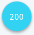

# Introduction

Welcome to the [SatoshiPay](https://satoshipay.io/) API! You can use this API to make digital goods like articles, images, videos and downloadable files available for purchase using the SatoshiPay [widget](#sun-of-satoshi). This documentation covers:

* [Digital Goods API](#digital-goods-api) - Register and manage digital goods with SatoshiPay
* [HTML Tags](#html-tags) - How to embed digital goods into your website
* [HTTP Endpoints](#http-endpoints) - How to deliver paid digital goods to your users
* [Reference](#reference) - Complete list of supported content types

## SatoshiPay and You

To understand how SatoshiPay works you need to know the following:

* You need to register your digital goods with SatoshiPay
* You need to embed the digital goods and the SatoshiPay widget into your website
* SatoshiPay handles the payments
* You need to deliver the digital goods to your users via HTTP

The following diagram illustrates how your website and SatoshiPay interact with each other:

<p align="center">
  
</p>

The SatoshiPay backend manages a registry of your digital goods. This registry contains pricing and some meta information, but not the content itself. You can register and manage these goods using the [Digital Goods API](#digital-goods-api).

The goods can be embedded on your web page using [HTML Tags](#html-tags) with special data attributes. The location of the HTML tag determines the position of the digital good on the page, or if the good hasn't been paid yet, the position of its placeholder.

The special HTML tags are recognised by the SatoshiPay widget, which needs to be included on every page that contains digital goods for sale. When a user buys a digital good, the widget handles the payment process by communicating to the SatoshiPay backend using a WebSocket connection. After successful payment the widget receives a payment receipt, which in turn is used to fetch the content of the good from a special [HTTP Endpoint](#http-endpoints) provided by you.

## Sun of Satoshi

> Include SatoshiPay Widget

```html
<script src="https://wallet.satoshipay.io/satoshipay.js"></script>
```

We've nicknamed our website widget "Sun of Satoshi" to honour Bitcoin's anonymous creator Satoshi Nakamoto. It will float at the bottom right of the page and look like this:

<p>
  
</p>

The widget displays a user's current balance in lumens and, when clicked, a menu with items for top-up, settings and help. It can be included *anywhere* on *any* web page and will automatically transform SatoshiPay [HTML Tags](#html-tags) into digital goods. See it in action at the <a href="https://satoshipay.io/">SatoshiPay website</a>.

The widget performs the following tasks:

* Generate a Stellar wallet and keep it in the user's LocalStorage
* Communicate with SatoshiPay servers
* Control digital goods on the web page
* Interact with the user via menus and messages
