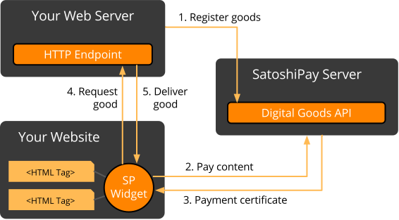

# Introduction

Welcome to the SatoshiPay API! You can use this API to make digital goods like articles, images, video/audio and downloadable files available for purchase using the SatoshiPay widget. This documentation covers:

* [Digital Goods API](#digital-goods-api) - Register and manage digital goods with SatoshiPay
* [HTML Tags](#content-items) - How to embed digital goods into your website
* [HTTP Resource](#content-api) - How to deliver paid content to your users

### SatoshiPay and You

To understand how SatoshiPay works you need to know the following:

* You need to register your digital goods with SatoshiPay
* You need to embed the digital goods and the SatoshiPay widget into your website
* SatoshiPay handles the payments
* You need to deliver the digital goods to your users via HTTP

The following diagram illustrates how your website and SatoshiPay interact with each other:

  

The SatoshiPay backend manages a registry of your digital goods. This registry only contains pricing and some meta information, but not the content itself. You can register and manage these goods through the Digital Goods API.

The goods can be embedded on your web page using HTML tags with special data attributes. The location of the HTML tag determines the position of the digital good on the page, or the position of its placeholder, if the good hasn't been paid yet.

The special HTML tags are recognised by the SatoshiPay widget, which needs to be included on every page that contains digital goods for sale. When the consumer buys a digital good, the widget handles the payment process by communicating to the SatoshiPay backend using a WebSocket connection. After a successful payment the widget receives a payment certificate, which is then used to fetch the actual content of the good from a special HTTP resource provided by you.
